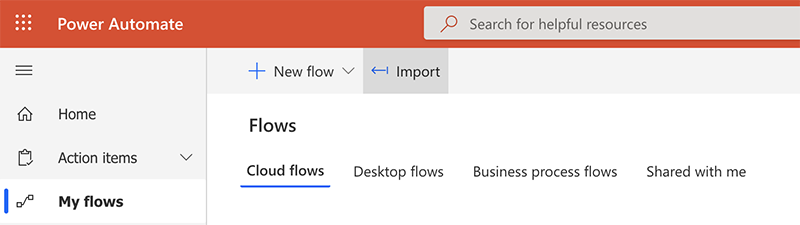

# mss-power-automate-flows
 
This repo contains some sample flows I have created to automate tasks for myself, the most common being to receive a report file from a particular source, import it to a Sharepoint list, and then update graphs, etc., based on that. Some of the more complex changes were easier to work with in code, so I developed a couple flows that allow me to download JSON definitions for the flows, update them in a text editor, and then reimport them. 

## Format

Each flow is represented by two JSON files--a definition file and a connection references file. They are named using the id of the flow (as generated by the "Backup My Flows to Sharepoint" flow). Definition file is named as just the flow ID (e.g. `7bd62a15-ab20-4d5a-ad9e-5d28bab1c99f.json`) and the connection references file is the flow ID + "-conn" (e.g. `7bd62a15-ab20-4d5a-ad9e-5d28bab1c99f-conn.json`).

## Folder Structure
### Flow JSON Tools

Two flows that [export a copy of all existing flows](Flow%20JSON%20Tools/Backup%20My%20Flows%20to%20Sharepoint) to a specified Sharepoint/OneDrive folder and accept [uploads of an existing flow](Flow%20JSON%20Tools/Update%20Flow%20from%20JSON) to update that flow. Currently the flow must already exist, but I plan to add another option to create a new flow from existing JSON.

These flows also contain a .zip import that can be used to import the flows initially into the Power Automate interface. In Power Automate, click "My Flows" and then "Import->".

### General Flows

These are the flows I've created. The email ones (beginning with "Email - ") are basically the same; they just check for a specific type of email and then give the attached file a specific name to prepare for the [Update Lists](General%20Flows/Update%20Lists) flow, which imports those files based on the naming conventions in the Email flows. [Clean Inbox](General%20Flows/Clean%20Inbox) is a simple tool that archives all emails that aren't either flagged or unread in my inbox and are older than 24 hours. 